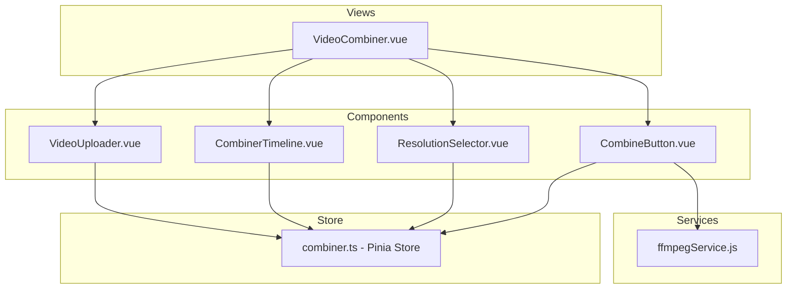
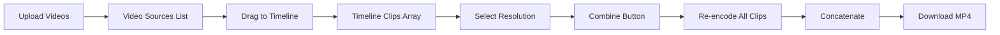

# Video Combiner Feature - Implementation Plan

## Overview

Create a new "Video Combiner" page that allows users to upload video clips, arrange them in any order on a visual timeline, select an output resolution, and combine them into a single downloadable video.

## Requirements Summary

| Requirement | Details |
|-------------|---------|
| **Page Name** | Video Combiner |
| **Route** | `/combiner` |
| **Timeline** | Horizontal track with named rectangles, length based on total clip duration |
| **Clip Handling** | Full clips only, no trimming |
| **Repetition** | Same video can be added multiple times to timeline |
| **Resolutions** | 144p, 240p, 360p, 480p, 720p, 1080p |
| **Aspect Ratio** | Always 16:9 output, letterbox/pillarbox for different ratios |
| **Audio** | Keep sequential audio from each clip |

## Architecture

### Component Diagram



### Data Flow



## File Structure

```
src/
├── views/
│   └── VideoCombiner.vue          # New page
├── components/
│   ├── combiner/
│   │   ├── VideoUploader.vue      # Upload area and video list
│   │   ├── CombinerTimeline.vue   # Drag-drop timeline
│   │   ├── ResolutionSelector.vue # Resolution dropdown
│   │   └── CombineButton.vue      # Render button with progress
├── stores/
│   └── combiner.ts                # New Pinia store
├── services/
│   └── ffmpegService.js           # Extend with combineVideos method
└── router/
    └── index.ts                   # Add new route
```

## Implementation Details

### 1. Pinia Store - combiner.ts

**State:**
- `videoSources: VideoSource[]` - Uploaded video files with metadata
- `timelineClips: TimelineClip[]` - Ordered list of clips on timeline
- `selectedResolution: Resolution` - User-selected output resolution
- `isProcessing: boolean` - Processing state
- `processProgress: number` - Progress percentage

**Interfaces:**
```typescript
interface VideoSource {
  sourceId: string
  file: File
  duration: number
  color: string
}

interface TimelineClip {
  id: string
  sourceId: string
  order: number  // Position in timeline
}

type Resolution = 144 | 240 | 360 | 480 | 720 | 1080
```

**Actions:**
- `addVideoSource(file, duration)` - Add uploaded video
- `removeVideoSource(sourceId)` - Remove video and related clips
- `addToTimeline(sourceId)` - Add clip to end of timeline
- `insertAtPosition(sourceId, position)` - Insert clip at position
- `removeFromTimeline(clipId)` - Remove clip from timeline
- `reorderTimeline(fromIndex, toIndex)` - Reorder clips
- `setResolution(resolution)` - Set output resolution
- `clearAll()` - Reset state

### 2. VideoUploader Component

**Features:**
- Drag-and-drop upload area for video files
- Accept multiple common video formats: MP4, WebM, MOV, AVI, MKV
- Display list of uploaded videos with:
  - Color indicator
  - Filename
  - Duration
  - Remove button
- Draggable items for dropping onto timeline
- Click to preview video

**Reuse:** Can adapt from existing `MP4Uploader.vue`, expanding file type support.

### 3. CombinerTimeline Component

**Features:**
- Horizontal scrollable track
- Drop zone for receiving dragged videos
- Display clips as colored rectangles with video names
- Show clip duration on each rectangle
- Drag to reorder clips within timeline
- Click to select, Delete key to remove
- Display total timeline duration

**Visual Design:**
```
┌─────────────────────────────────────────────────────────────────┐
│ Timeline                                            Total: 2:45 │
├─────────────────────────────────────────────────────────────────┤
│ ┌──────────┐ ┌──────────┐ ┌──────────┐ ┌──────────┐            │
│ │ clip1.mp4│ │ clip2.mp4│ │ clip1.mp4│ │ clip3.mp4│   [+] Add  │
│ │  0:30    │ │  0:45    │ │  0:30    │ │  1:00    │            │
│ └──────────┘ └──────────┘ └──────────┘ └──────────┘            │
└─────────────────────────────────────────────────────────────────┘
```

### 4. ResolutionSelector Component

**Features:**
- Dropdown/button group with resolution options
- Options: 144p, 240p, 360p, 480p, 720p, 1080p
- Display actual pixel dimensions: e.g., 1920x1080

**Resolution Map:**
| Label | Width | Height |
|-------|-------|--------|
| 144p  | 256   | 144    |
| 240p  | 426   | 240    |
| 360p  | 640   | 360    |
| 480p  | 854   | 480    |
| 720p  | 1280  | 720    |
| 1080p | 1920  | 1080   |

### 5. CombineButton Component

**Features:**
- Disabled until timeline has clips
- Shows processing status and progress bar when active
- Displays summary: clip count, total duration, output resolution
- Triggers FFmpeg processing
- Auto-downloads result

### 6. FFmpeg Service Extension

**New Method: `combineVideos()`**

```javascript
async combineVideos(
  clips,           // Array of { source: VideoSource, id: string }
  resolution,      // Target resolution object { width, height }
  onProgress,      // Progress callback
  onStatusUpdate   // Status text callback
)
```

**Processing Steps:**

1. **Re-encode each clip:**
   - Scale to target resolution maintaining aspect ratio
   - Add padding for letterbox/pillarbox effect
   - Normalize codec: libx264, AAC audio
   - Command: 
   ```
   -i input.mp4 
   -vf "scale=WIDTH:HEIGHT:force_original_aspect_ratio=decrease,pad=WIDTH:HEIGHT:-1:-1:color=black,format=yuv420p" 
   -c:v libx264 -preset ultrafast -crf 23 
   -c:a aac -b:a 128k 
   output.mp4
   ```

2. **Concatenate clips:**
   - Use concat demuxer for efficient joining
   - Stream copy since all clips are now uniform format

3. **Output final video:**
   - Add faststart flag for web playback
   - Return as Blob for download

### 7. Router Update

Add new route in `src/router/index.ts`:

```typescript
{
  path: '/combiner',
  name: 'VideoCombiner',
  component: () => import('../views/VideoCombiner.vue')
}
```

### 8. Navigation

Add a link to Video Combiner in the app header or as a secondary navigation option.

## Page Layout

```
┌─────────────────────────────────────────────────────────────────┐
│  Video Combiner                                                 │
├─────────────────────────────────────────────────────────────────┤
│                                                                 │
│  ┌─────────────────────────────────────────────────────────┐   │
│  │  1. Upload Video Clips                                   │   │
│  │  ┌─────────────────────────────────────────────────────┐ │   │
│  │  │  Drag and drop videos here, or click to browse      │ │   │
│  │  └─────────────────────────────────────────────────────┘ │   │
│  │                                                           │   │
│  │  Available Clips:                                         │   │
│  │  [clip1.mp4 - 0:30] [clip2.mp4 - 0:45] [clip3.mp4 - 1:00]│   │
│  └─────────────────────────────────────────────────────────┘   │
│                                                                 │
│  ┌─────────────────────────────────────────────────────────┐   │
│  │  2. Arrange Timeline                                     │   │
│  │  ┌─────────────────────────────────────────────────────┐ │   │
│  │  │  Drop videos here to build your sequence             │ │   │
│  │  │  [clip1] [clip2] [clip1] [clip3]                     │ │   │
│  │  └─────────────────────────────────────────────────────┘ │   │
│  │  Total Duration: 2:45                                     │   │
│  └─────────────────────────────────────────────────────────┘   │
│                                                                 │
│  ┌─────────────────────────────────────────────────────────┐   │
│  │  3. Select Output Resolution                             │   │
│  │  [144p] [240p] [360p] [480p] [720p] [1080p]             │   │
│  └─────────────────────────────────────────────────────────┘   │
│                                                                 │
│  ┌─────────────────────────────────────────────────────────┐   │
│  │  4. Combine & Download                                   │   │
│  │  [═══════════════════════ 75% ═══════════════          ] │   │
│  │  [         🎬 Combine Videos          ]                  │   │
│  └─────────────────────────────────────────────────────────┘   │
│                                                                 │
└─────────────────────────────────────────────────────────────────┘
```

## Technical Considerations

1. **File Format Support**: Accept common video formats, FFmpeg will handle transcoding
2. **Memory Management**: Large videos may require chunked processing
3. **Progress Tracking**: Use FFmpeg time-based progress relative to total output duration
4. **Error Handling**: Handle unsupported codecs, corrupted files gracefully
5. **Performance**: Use `ultrafast` preset for acceptable speed/quality tradeoff

## Testing Scenarios

1. Upload single video and combine
2. Upload multiple videos with different formats
3. Add same video multiple times to timeline
4. Reorder clips on timeline
5. Remove clips from timeline
6. Test all resolution options
7. Handle very large files
8. Handle very small files
9. Cancel/interrupt processing
10. Error recovery

---

## Summary

This plan creates a standalone Video Combiner feature that reuses patterns from the existing music video editor while introducing a simpler timeline model focused on clip arrangement rather than audio synchronization.
